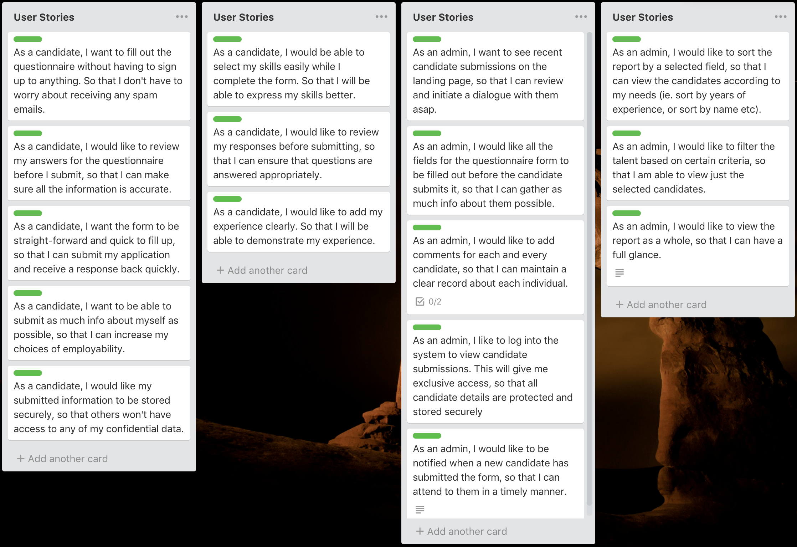
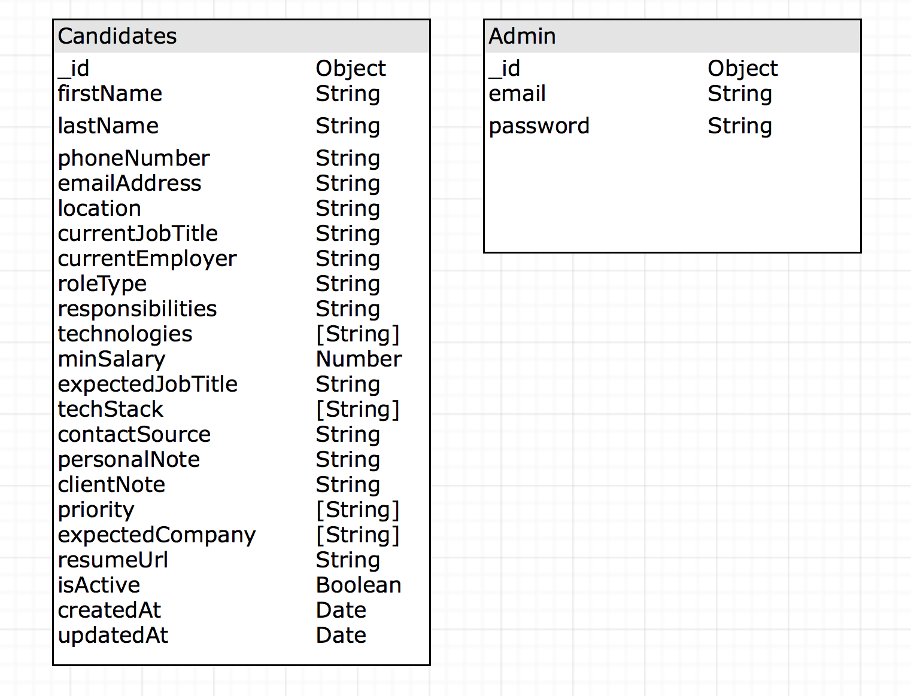
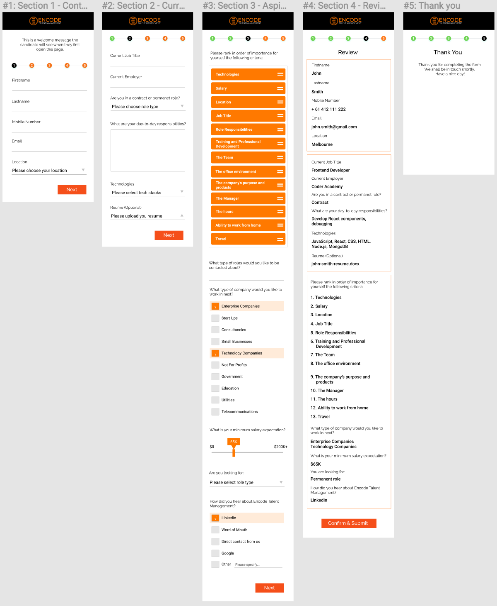
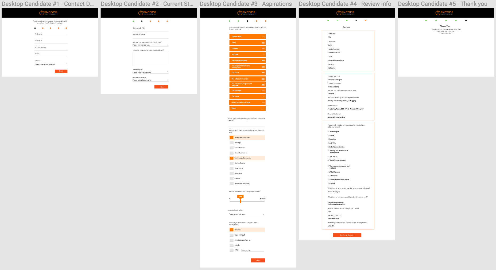
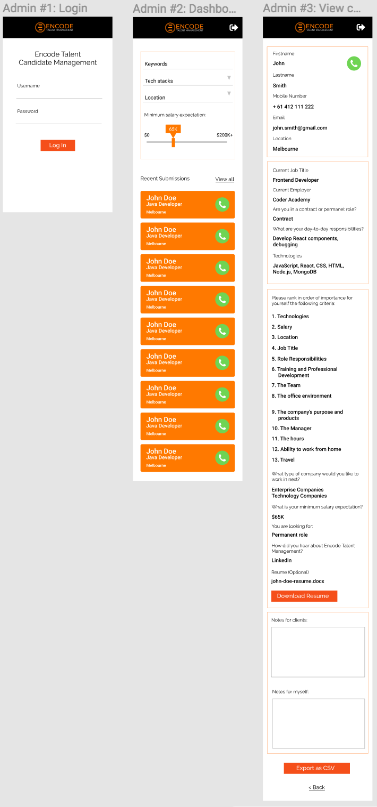
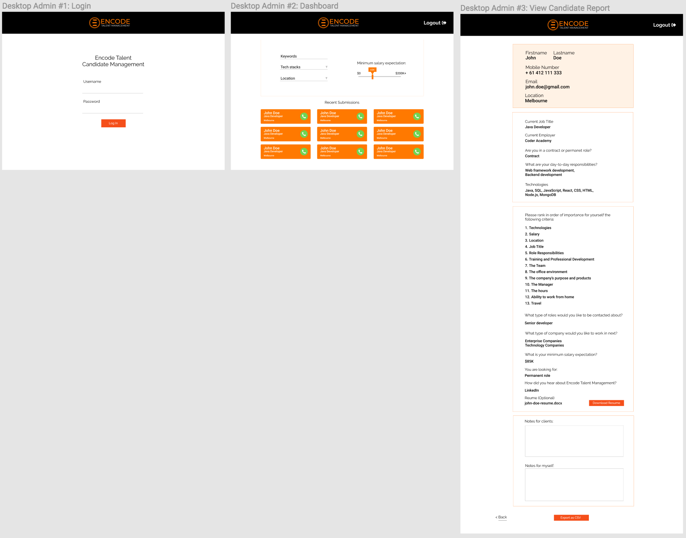
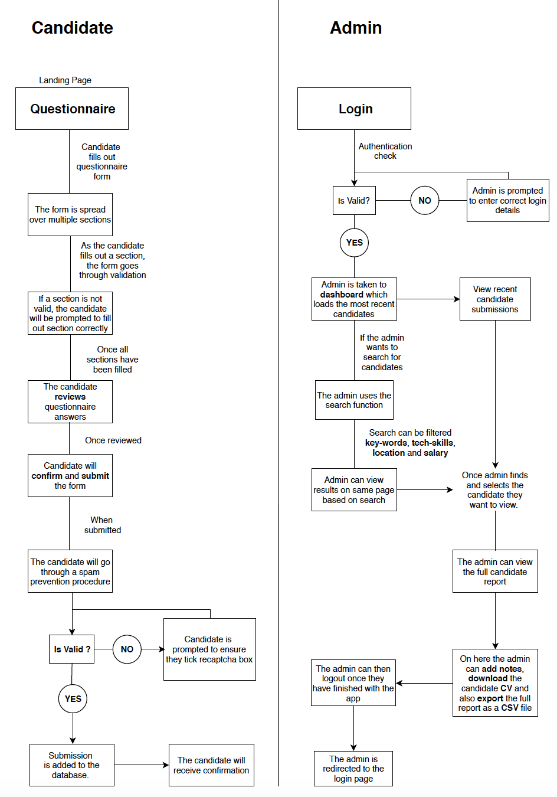

# Part B - Project

<!-- Link to github repo -->
<!-- Link to candidate form -->
<!-- Link to admin view -->

## Group Members
- Mill Daulagala
- Maurice Yong
- Rashid Elhouli
- Ashley Tsai

## Client
  

  Encode Talent Management provides career advocacy services for Australia’s premier IT and Digital professionals. 

  The person of contact was **Simon Cook**. He is the recruitment principal for Encode Talent Management. His main emphasis is on understanding his candidates' (people looking for work) qualities, career goals and aspirations before matching them with clients (employers seeking employees)

  ## Problem
  A major part of Simon's work is dealing with candidates via phone calls, where he runs an extensive questionnaire to get as much information about them as possible. He spends 75% of his time on the phone and documents all his data manually in his notebook and then manually enters the data into an Excel spreadsheet

  Relying on a combination of Excel, Hubspot, written notes and his own memory, he matches candidates with clients, conducting further meetings to gather more information from candidates if necessary. He has become overwhelmed by the great amount of work and is struggling to keep things in order and so he has reached out to us for a solution. 
  
  ## Solution
  After our first meeting with Simon, we decided that the best solution is to have part of his work automated. We figured an online solution will help solve his problems and increase efficiency.
  
  To solve his problem, we built an app that will feature a questionnaire that his candidates can fill out. He can view all their responses once they submit. He will have a database of all the candidates who submitted the questionnaire and will be able to filter through them accodrding to his needs. He can also export the candidates' data as a CSV file. This will dramatically reduce the amount of time used for phone calls and help him better keep track of all his candidates.

  
  ## The App
  The app was built using the MERN (MongoDB, Express, ReactJs and NodeJs) stack. We used Node.js as a runtime environment to build this app, and React as our JavaScript library/framework to develop the frontend. We used Express framework for our backend, and connected to MongoDB database by using Mongoose as our driver.

  We have two frontends; one for the candidate questionnaire form and one for the Admin user to view the candidate submissions. 
  
  The app consists of two major components: candidates and admininstrator. The candidate information is collected, validated and stored into the database, and the administrator has access to the data for further management and manipulation. The candidate form and admin view are on 2 separate URLs.

  ### Candidates Form
  This is the functional form we built for the client. It is broken into different sections and the candidates will be asked to fill out each section and answer all the questions in this form. The candidates do not have to sign-in / sign-up to fill out the form. Once they have filled and submitted the form, the form will reload and will be ready for a new submission. 

  ### Administrator view
  The admin has access to the form data filled out by each candidate. The admin can view all the submission content of the candidates'. The admin can also export this data as a CSV file. The admin user must be authorised in order to access this data, therefore they will be asked to login in before they are granted access. 

  ### Validation
  We used the following:
  - 'react-validation-mixin'
  - 'joi-validation-strategy'
  - 'joi-browser'

  These were used for the validation of data for each section of the form. This ensures that candidates fill out each section of the form. The form cannot be submitted unless it is fully validated. 

  ### Testing
  Due to the time constraints given for the project, we are unable to incorporate a fully test driven development scheme. However, tests were written for the functional client-end components to ensure that features built for client interaction worked. We used Jest as our testing framework for its simplicity and speedy performance.

  <!-- We can talk about integrations and unit tests???? -->

  ### Authorisation
  - JWT 

  ### Tools used  
  - **Trello:** This help us implement an agile approach throughout the project. We were able to document our progress and keep all our project resources in one place. We used it to keep track of each task and sprint. 

    Below is the user stories:
    

    For a full view of the user stories, click on the
    [Link to Trello User Stories](https://trello.com/b/v3SlV6aZ)

    Below are the project resources:
    

    For a full view of the project resources, click on the (LINK HERE)
    <!-- [Link to Trello Project Resources]() -->

    Below is the project timeline:
        
    For a full view of the project timeline, click on the (LINK HERE)
    <!-- [Link to Trello Project Timeline]() -->

  - **Database Schema:**
    Here is the schema for our database:

    

  - **Wireframes:** We used figma for all our design    planning. It is a powerful tool that allows for     effective team collaboration and design. 

    Below are images of our designs:

    Mobile view for candidate form:
    

    Desktop view for candidate form:
    

    Mobile view for admin page:
    

    Desktop view for admin page:
    

    For full view of our design, click on the
    [Link to Figma Design](https://www.figma.com/file/FyYzMMwDQTa4StkPC1kPjeiP/App-Design)

  - **Workflow Diagram:** We used an online   software called Draw io. It has full       functionality to draw and label diagrams.
  
    Below is the workflow diagram for the app:
        
  
### Pain Points
- Different states and components
- Joi validation when deployed
- Mongo db connection issues
- JWT Auth for admin user

### Github 
- Our contributions on github
- colloboration
- forking 

### Future development

### Lessons learnt 

  

